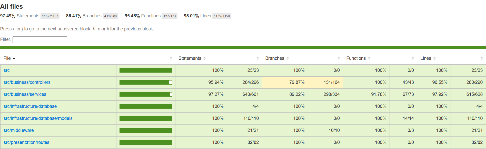
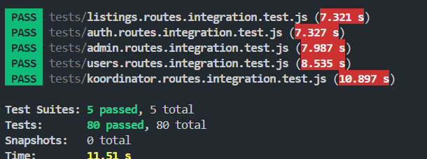

# Proof of Testing — Sprint 7

> Ovaj dokument predstavlja objedinjeni dokaz testiranja za Sprint 7 i obuhvata:
>
> - unit testove middleware-a, servisa i ruta,
> - integracione testove API endpointa,
> - RBAC i sigurnosne provjere,
> - testiranje koordinatorskog workflow-a,
> - autentifikaciju i autorizaciju,
> - upravljanje korisnicima,
> - pregled i uređivanje profila,
> - deaktivaciju/brisanje naloga,
> - ručno UI testiranje i coverage izvještaj.

---

# 1. Coverage Summary

Ukupna pokrivenost backend testovima ostvarena tokom Sprinta 7:

| Metric | Coverage |
|---|---|
| Statements | **97.49%** |
| Branches | **86.41%** |
| Functions | **95.48%** |
| Lines | **98.01%** |

---

# 2. Ukupni rezultati testiranja

| Nivo | Modul | Alat | Broj testova | Rezultat |
| --- | --- | --- | --- | --- |
| Unit — Middleware | Auth middleware | Jest | 6 | PASS |
| Unit — Middleware | RBAC middleware | Jest | 6 | PASS |
| Unit — Service | Auth service | Jest + mockovi | 40 | PASS |
| Unit — Routes | Auth routes | Jest + Supertest | 41 | PASS |
| Integracijsko | Auth flow | Jest + Supertest + JWT + bcrypt | 8 | PASS |
| Unit — Service | Approval service | Jest + mockovi | 19 | PASS |
| Unit — Routes | Approval routes | Jest + Supertest | 12 | PASS |
| Unit — Service | Admin service | Jest + Sequelize mockovi | 46 | PASS |
| Unit — Routes | Admin routes | Jest + Supertest | 37 | PASS |
| Integracijsko | Admin API | Jest + Supertest + JWT | 21 | PASS |
| Unit — Service | Koordinator service | Jest + Sequelize mockovi | 37 | PASS |
| Unit — Routes | Koordinator routes | Jest + Supertest | 36 | PASS |
| Integracijsko | Koordinator workflow | Jest + Supertest + DB | 23 | PASS |
| Unit — Service | Users/Profile service | Jest + mockovi | 48 | PASS |
| Unit — Routes | Users/Profile routes | Jest + Supertest | 36 | PASS |
| Placeholder routes | Notifications/Applications | Jest + Supertest | 2 | PASS |
| **Ukupno** | Sprint 7 backend | Jest + Supertest + Sequelize | **418 testova** | **PASS** |

---

# 3. Testirane funkcionalnosti

| Funkcionalnost | Tip testiranja | Šta je provjereno | Rezultat |
|---|---|---|---|
| Registracija korisnika | Unit + integraciono | Validacija emaila, passworda, jedinstvenost username/email | PASS |
| Login korisnika | Unit + integraciono | JWT generisanje, validacija kredencijala, status naloga | PASS |
| Email verifikacija | Unit + integraciono | Verifikacija tokena, resend email workflow | PASS |
| RBAC zaštita | Unit + integraciono | Zaštita ruta po rolama | PASS |
| Admin upravljanje korisnicima | Unit + integraciono | Promjena role/statusa, pregled korisnika | PASS |
| Koordinator dashboard | Unit + integraciono | Dashboard statistike i pregled zahtjeva | PASS |
| Odobravanje/odbijanje studenata | Unit + integraciono | Approve/reject workflow | PASS |
| Pregled korisničkog profila | Unit | Dohvat profila i validacija pristupa | PASS |
| Uređivanje profila kompanije | Unit | Ažuriranje podataka kompanije | PASS |
| Deaktivacija/brisanje naloga | Unit + integraciono | Blokade i poslovna pravila | PASS |
| UI dashboard navigacija | Ručno UI testiranje | Sidebar, role-based navigacija | PASS |
| Pregled oglasa | Ručno UI testiranje | Lista oglasa, filteri, search | PASS |

---

# 4. SB-08 — Pristup koordinatora

## Pokriveni acceptance criteria

| AC | Test koji pokriva | Status |
|---|---|---|
| Koordinator vidi dashboard statistike | `GET /api/koordinator/dashboard` | PASS |
| Koordinator vidi samo studente svog fakulteta | `GET /api/koordinator/studenti` | PASS |
| Koordinator može pregledati prijave | `GET /api/koordinator/prijave` | PASS |
| Koordinator može odobriti studenta | `PATCH /studenti/:id/odobri` | PASS |
| Koordinator može odbiti studenta uz razlog | `PATCH /studenti/:id/odbij` | PASS |
| STUDENT ne može pristupiti koordinatorskim rutama | RBAC testovi | PASS |
| Zahtjev bez tokena vraća 401 | Middleware + integration testovi | PASS |

## Relevantni test fajlovi

```text
backend/tests/koordinator.routes.integration.test.js
backend/tests/unit/koordinator.service.test.js
backend/tests/unit/koordinator.routes.test.js
backend/tests/unit/rbac.middleware.test.js
```

---

# 5. SB-40 — Deaktivacija i brisanje naloga

## Pokriveni acceptance criteria

| AC | Test koji pokriva | Status |
|---|---|---|
| Korisnik može deaktivirati nalog | `deactivateMyAccount` | PASS |
| Korisnik može trajno obrisati nalog | `deleteMyAccount` | PASS |
| Deaktiviran korisnik se ne može prijaviti | Login integration test | PASS |
| Student sa odobrenom praksom ne može deaktivirati nalog | Business rule test | PASS |
| Kompanija s aktivnim oglasima ne može obrisati nalog | Company delete test | PASS |
| Aktivne prijave se automatski povlače | Service layer test | PASS |

## Relevantni test fajlovi

```text
backend/tests/unit/users.service.test.js
backend/tests/unit/users.routes.test.js
backend/tests/auth.routes.integration.test.js
```

---

# 6. SB-42 — Navigacija i kontrola pristupa po rolama

## Pokriveni acceptance criteria

| AC | Test koji pokriva | Status |
|---|---|---|
| Zahtjev bez tokena vraća 401 | `auth.middleware.test.js` | PASS |
| Invalid JWT vraća 401 | `auth.middleware.test.js` | PASS |
| Expired JWT vraća 401 | `auth.middleware.test.js` | PASS |
| Validan JWT postavlja `req.user` | `authenticate middleware` | PASS |
| STUDENT ne može pristupiti ADMIN rutama | `rbac.middleware.test.js` | PASS |
| COORDINATOR može pristupiti koordinatorskim rutama | `authorize middleware` | PASS |
| Login vraća validan JWT | `auth.routes.integration.test.js` | PASS |

## Relevantni test fajlovi

```text
backend/tests/unit/auth.middleware.test.js
backend/tests/unit/rbac.middleware.test.js
backend/tests/unit/auth.routes.test.js
backend/tests/auth.routes.integration.test.js
```

---

# 7. SB-44 — Pregled korisničkog profila

| AC | Test koji pokriva | Status |
|---|---|---|
| Korisnik može pregledati svoj profil | `GET /company-profile` | PASS |
| Sistem vraća 404 za nepostojeći profil | Service layer test | PASS |
| Profil nije dostupan bez autentifikacije | Middleware test | PASS |

## Relevantni test fajlovi

```text
backend/tests/unit/users.service.test.js
backend/tests/unit/users.routes.test.js
```

---

# 8. SB-45 — Uređivanje profila kompanije

| AC | Test koji pokriva | Status |
|---|---|---|
| Kompanija može ažurirati podatke | `PATCH /company-profile` | PASS |
| Naziv kompanije je obavezan | Validation test | PASS |
| Sistem kreira zapis ako profil ne postoji | `Kompanija.create` test | PASS |
| Neprijavljen korisnik ne može uređivati profil | Auth middleware test | PASS |

## Relevantni test fajlovi

```text
backend/tests/unit/users.service.test.js
backend/tests/unit/users.routes.test.js
```

---

# 9. Ručno UI testiranje


Pored automatizovanih testova izvršeno je i ručno testiranje korisničkog interfejsa.

Ručno su provjereni:

- registracija i prijava korisnika,
- navigacija prilagođena korisničkoj roli,
- redirect logika nakon login-a,
- prikaz dashboard-a za različite role,
- pregled i pretraga oglasa,
- pregled i uređivanje profila,
- koordinatorski dashboard i pregled prijava,
- zaštita ruta na frontend-u,
- logout funkcionalnost,
- validacija formi i prikaz grešaka,
- responzivnost osnovnih stranica.

Tokom ručnog testiranja nisu pronađene kritične greške koje blokiraju funkcionalnosti Sprinta 7.

---

| ID | Scenarij | Očekivani rezultat | Status |
|---|---|---|---|
| UI-01 | Registracija korisnika | Kreira se nalog i šalje verifikacioni email | PASS |
| UI-02 | Login korisnika | Redirect na dashboard prema roli | PASS |
| UI-03 | Login validacija | Greška za neispravne podatke | PASS |
| UI-04 | Collapsing sidebar | Sidebar se proširuje hoverom | PASS |
| UI-05 | Dashboard navigacija | Navigacija radi bez reload-a | PASS |
| UI-06 | Pregled oglasa | Lista aktivnih oglasa prikazana | PASS |
| UI-07 | Search oglasa | Lista se filtrira prema keyword-u | PASS |
| UI-08 | Filter oglasa | Lista se dinamički ažurira | PASS |
| UI-09 | Detalji oglasa | Otvara se detaljan prikaz | PASS |
| UI-10 | Koordinator detalji prijave | Prikazuju se podaci o studentu | PASS |
| UI-11 | Zaštićene rute | Neovlašten korisnik dobija redirect | PASS |
| UI-12 | Regresiono UI testiranje | Nema regresija nakon refaktora | PASS |

---

# 10. Pokretanje testova

## Pokretanje svih testova

```bash
npm test
```

## Coverage report

```bash
npm test -- --coverage
```

<p align="center">
  
</p>

<p align="center">
  
</p>


# 11. Zaključak

Sprint 7 backend funkcionalnosti uspješno su pokrivene kombinacijom:

- unit testova,
- integracionih testova,
- sigurnosnih/RBAC testova,
- middleware testova,
- ručnog UI testiranja,
- regresionog testiranja.

Testirani su svi ključni korisnički tokovi:

- registracija,
- login,
- email verifikacija,
- koordinatorski workflow,
- admin upravljanje korisnicima,
- pregled i uređivanje profila,
- deaktivacija/brisanje naloga,
- role-based pristup sistemu.

Sistem zadovoljava acceptance kriterije definisane za Sprint 7.