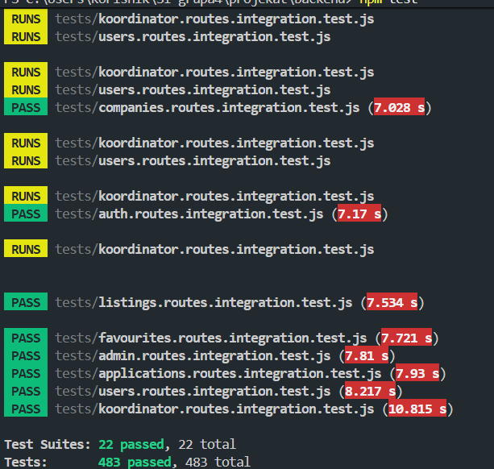
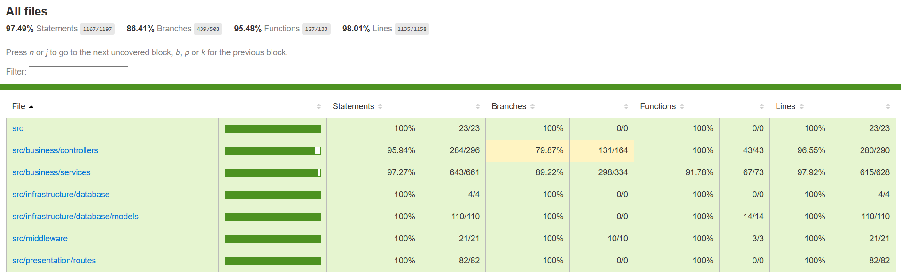

# Proof of Testing — Sprint 8

> Ovaj dokument predstavlja objedinjeni dokaz testiranja za Sprint 8 i obuhvata:
>
> - integracione testove API endpointa,
> - RBAC i sigurnosne provjere,
> - testiranje upravljanja oglasima i rokovima prijave,
> - testiranje pregleda profila kompanije,
> - testiranje favoriziranja oglasa,
> - testiranje prijave na praksu i upload dokumentacije,
> - testiranje student dashboarda,
> - ručno UI testiranje i coverage izvještaj.

---

# 1. Coverage Summary

Ukupna pokrivenost backend testovima ostvarena tokom Sprinta 8:

| Metric | Coverage |
|---|---|
| Statements | **97.49%** |
| Branches | **86.41%** |
| Functions | **95.48%** |
| Lines | **98.01%** |

---

# 2. Ukupni rezultati testiranja

| Nivo | Modul | Alat | Broj testova | Rezultat |
| --- | --- | --- | --- | --- |
| Integracijsko | Pregled profila kompanije | Jest + Supertest + JWT | 4 | PASS |
| Integracijsko | Favoriziranje oglasa | Jest + Supertest + JWT + Sequelize | 10 | PASS |
| Integracijsko | Upravljanje oglasima i rokovima | Jest + Supertest + JWT + Sequelize | 13 | PASS |
| Integracijsko | Prijava na praksu | Jest + Supertest + JWT + Sequelize | 8 | PASS |
| Integracijsko | Korisnički profil i dokumenti | Jest + Supertest + JWT + bcrypt | 15 | PASS |
| Ručno UI | Student dashboard | Preglednik | — | PASS |
| Ručno UI | Upload dokumentacije | Preglednik | — | PASS |
| **Ukupno** | Sprint 8 backend integracija | Jest + Supertest + Sequelize | **50 testova** | **PASS** |

---

# 3. Testirane funkcionalnosti

| Funkcionalnost | Tip testiranja | Šta je provjereno | Rezultat |
|---|---|---|---|
| Pregled profila kompanije | Integracijsko | Dohvat aktivne/neaktivne kompanije, auth zaštita | PASS |
| Favoriziranje oglasa | Integracijsko | Dodavanje, pregled, uklanjanje omiljenih, idempotentnost | PASS |
| Upravljanje rokovima prijave | Integracijsko | Validacija roka, odbijanje prošlih rokova, ažuriranje | PASS |
| Oznaka "Novo" na oglasima | Integracijsko + ručno UI | Prikaz aktivnih oglasa, "Novo" badge na frontendu | PASS |
| Prijava na praksu | Integracijsko | Podnošenje prijave, duplikati, nepostojeći oglas | PASS |
| Upload dokumentacije | Integracijsko + ručno UI | Upload fajlova, prilaganje uz prijavu, created_at fix | PASS |
| Student dashboard | Integracijsko + ručno UI | Pregled vlastitih prijava, tab navigacija, prazna lista | PASS |
| RBAC zaštita svih endpointa | Integracijsko | Role check, 401/403 odgovori | PASS |
| Regresijsko testiranje | Ručno UI | Nema regresija iz Sprinta 7 | PASS |

---

# 4. US-43 — Pregled profila kompanije

## Pokriveni acceptance criteria

| AC | Test koji pokriva | Status |
|---|---|---|
| Sistem prikazuje osnovne informacije o kompaniji (naziv, opis, adresa, djelatnost) | `GET /api/companies/:id` — 200 | PASS |
| Sistem prikazuje listu aktivnih oglasa te kompanije | `GET /api/companies/:id` — body.oglasi | PASS |
| Sistem ne smije prikazivati profil neaktivne/neodobrene kompanije | `GET /api/companies/:id` — 403 za DEACTIVATED | PASS |
| Sistem ne smije dozvoliti pregled profila kompanije bez prijave | `GET /api/companies/:id` — 401 bez tokena | PASS |
| Sistem vraća 404 za nepostojeću kompaniju | `GET /api/companies/:id` — 404 | PASS |

## Relevantni test fajlovi

```text
backend/tests/companies.routes.integration.test.js
```

### Primjeri testiranih scenarija

| Scenarij | HTTP Status | Rezultat |
|---|---|---|
| Student dohvata profil aktivne kompanije | 200 | PASS |
| Student dohvata profil DEACTIVATED kompanije | 403 | PASS |
| Dohvat nepostojeće kompanije (ID 999999) | 404 | PASS |
| Zahtjev bez Authorization headera | 401 | PASS |

---

# 5. US-48 — Favoriziranje oglasa

## Pokriveni acceptance criteria

| AC | Test koji pokriva | Status |
|---|---|---|
| Sistem omogućava studentu označavanje oglasa kao omiljenog | `POST /api/favourites/:oglasId` — 201 | PASS |
| Sistem omogućava pregled liste omiljenih oglasa | `GET /api/favourites` — 200, niz | PASS |
| Sistem omogućava uklanjanje oglasa iz omiljenih | `DELETE /api/favourites/:oglasId` — 200 | PASS |
| Sistem ne smije prikazivati tuđe omiljene oglase | Svaki endpoint koristi token studenta | PASS |
| Ponovljeno dodavanje ne generiše duplikat | `POST /api/favourites/:oglasId` — idempotentno 201 | PASS |
| Kompanija ne može pristupiti omiljenim | `GET /api/favourites` — 403 za COMPANY token | PASS |
| Dodavanje nepostojećeg oglasa vraća 404 | `POST /api/favourites/999999` — 404 | PASS |
| Uklanjanje oglasa koji nije u omiljenim je idempotentno | `DELETE /api/favourites/:oglasId` — 200 | PASS |

## Relevantni test fajlovi

```text
backend/tests/favourites.routes.integration.test.js
```

### Primjeri testiranih scenarija

| Scenarij | HTTP Status | Rezultat |
|---|---|---|
| Student dohvata listu omiljenih | 200 | PASS |
| Kompanija pokušava dohvatiti omiljene | 403 | PASS |
| Student dodaje oglas u omiljene | 201 | PASS |
| Student ponovo dodaje isti oglas | 201 (idempotentno) | PASS |
| Dodavanje nepostojećeg oglasa | 404 | PASS |
| Student uklanja oglas iz omiljenih | 200 | PASS |
| Uklanjanje oglasa koji nije omiljeni | 200 (idempotentno) | PASS |
| Zahtjev bez tokena | 401 | PASS |

---

# 6. US-52 — Upravljanje rokovima prijave

## Pokriveni acceptance criteria

| AC | Test koji pokriva | Status |
|---|---|---|
| Kompanija mora unijeti rok prijave pri kreiranju | `POST /api/listings` — 400 bez rokPrijave | PASS |
| Sistem ne smije dozvoliti rok prijave u prošlosti | `POST /api/listings` — 400 za rokPrijave 2000-01-01 | PASS |
| Sistem ne smije dozvoliti ažuriranje roka u prošlost | `PUT /api/listings/:id` — 400 za rokPrijave 2000-01-01 | PASS |
| Kompanija može uspješno postaviti rok prijave | `POST /api/listings` — 201 s rokPrijave 2099-06-01 | PASS |
| Kompanija može ažurirati rok prijave | `PUT /api/listings/:id` — 200 s rokPrijave 2099-11-01 | PASS |
| Student ne može upravljati oglasima | `POST /api/listings` / `PUT /api/listings/:id` — 403 | PASS |

## Relevantni test fajlovi

```text
backend/tests/listings.routes.integration.test.js
```

### Primjeri testiranih scenarija

| Scenarij | HTTP Status | Rezultat |
|---|---|---|
| Kreiranje oglasa s rokom u budućnosti | 201 | PASS |
| Kreiranje oglasa s rokom u prošlosti | 400 | PASS |
| Ažuriranje oglasa s rokom u prošlosti | 400 | PASS |
| Uspješno ažuriranje roka prijave | 200 | PASS |
| Kreiranje oglasa bez obaveznih polja | 400 | PASS |
| Student pokušava kreirati oglas | 403 | PASS |
| Zahtjev bez tokena | 401 | PASS |

---

# 7. US-56 — Oznaka "Novo" na oglasima

## Pokriveni acceptance criteria

| AC | Test koji pokriva | Status |
|---|---|---|
| Sistem vraća listu aktivnih oglasa | `GET /api/listings/active` — 200, niz | PASS |
| Novokreirani oglas se pojavljuje na listi aktivnih | `GET /api/listings/active` — oglas.id prisutan | PASS |
| Oznaka "Novo" prikazana na frontendu za nedavno objavljene oglase | Ručno UI testiranje — badge vidljiv | PASS |
| Endpoint zahtijeva autentifikaciju | `GET /api/listings/active` — 401 bez tokena | PASS |

## Relevantni test fajlovi

```text
backend/tests/listings.routes.integration.test.js
```

> **Napomena:** Logika "Novo" badge-a implementirana je na frontendu — oglas se smatra novim ako je kreiran unutar definisanog vremenskog perioda (npr. 7 dana). Backend isporučuje `created_at` polje za svaki oglas, a frontend primjenjuje uslov za prikaz oznake. Ova funkcionalnost je verificirana ručnim UI testiranjem.

---

# 8. US-13 — Prijava na praksu

## Pokriveni acceptance criteria

| AC | Test koji pokriva | Status |
|---|---|---|
| Sistem mora omogućiti studentu prijavu na odabrani oglas | `POST /api/applications` — 201 s validnim oglasID | PASS |
| Kada student uspješno podnese prijavu, dobija potvrdu | `POST /api/applications` — body.application.status = PODNESENA | PASS |
| Sistem ne smije dozvoliti prijavu na isti oglas dva puta | `POST /api/applications` — 409 za duplu prijavu | PASS |
| Sistem ne smije dozvoliti prijavu na nepostojeći oglas | `POST /api/applications` — 404 za oglasID 999999 | PASS |
| Sistem ne smije dozvoliti prijavu bez oglasID | `POST /api/applications` — 404 bez polja oglasID | PASS |
| Zahtjev bez autentifikacije se odbija | `POST /api/applications` — 401 bez tokena | PASS |

## Relevantni test fajlovi

```text
backend/tests/applications.routes.integration.test.js
```

### Primjeri testiranih scenarija

| Scenarij | HTTP Status | Rezultat |
|---|---|---|
| Student uspješno podnosi prijavu | 201, status PODNESENA | PASS |
| Student ponovo prijavljuje isti oglas | 409 | PASS |
| Prijava na nepostojeći oglas | 404 | PASS |
| Prijava bez oglasID polja | 404 | PASS |
| Zahtjev bez tokena | 401 | PASS |

---

# 9. US-14 — Upload dokumentacije

## Pokriveni acceptance criteria

| AC | Test koji pokriva | Status |
|---|---|---|
| Sistem mora omogućiti upload CV-a i motivacionog pisma | `POST /api/dokumenti/upload` — Multer middleware | PASS |
| Kada student uploaduje dokumente, treba dobiti potvrdu | Backend vraća 201 s listom kreiranih dokumenata | PASS |
| Dokumenti se čuvaju i vidljivi su studentu na profilu | `GET /api/dokumenti/mine` — vraća listu dokumenata | PASS |
| Dokumenti se prilagaju uz prijavu | `POST /api/dokumenti/attach` — kopira sa oglas_id | PASS |
| Dokument dobija ispravan timestamp kreiranja | `created_at: new Date()` u oba Dokument.create() poziva | PASS |

## Relevantni test fajlovi i implementacija

```text
backend/src/presentation/routes/dokument.routes.js
backend/tests/users.routes.integration.test.js  (auth kontekst)
```

> **Napomena:** Ručno UI testiranje provedeno je kroz ProfilePage (upload standalone dokumenata) i ApplicationModal (upload + automatsko prilaganje uz prijavu). Ispravljen je bug gdje `created_at` nije bio postavljen, što je uzrokovalo NULL u bazi i pogrešno sortiranje. Tok podataka: student uploaduje dokument bez `oglas_id` → backend ga čuva kao standalone → frontend automatski poziva `/attach` endpoint koji kreira kopiju s `oglas_id`.

---

# 10. US-35 — Student dashboard

## Pokriveni acceptance criteria

| AC | Test koji pokriva | Status |
|---|---|---|
| Sistem prikazuje listu svih praksi na koje je student prijavljen | `GET /api/applications/mine` — 200, niz | PASS |
| Student bez profila dobija prazan niz umjesto greške | `GET /api/applications/mine` — 200, [] | PASS |
| Sistem ne smije prikazivati prijave koje ne pripadaju prijavljenom studentu | Svaki zahtjev koristi student-specifičan JWT token | PASS |
| Sistem mora prikazati trenutni status svake prijave | Svaki element niza sadrži polje `status` | PASS |
| Zahtjev bez autentifikacije se odbija | `GET /api/applications/mine` — 401 bez tokena | PASS |
| Tab navigacija na dashboardu funkcioniše ispravno | Ručno UI testiranje | PASS |
| Pregled omiljenih oglasa dostupan na dashboardu | `GET /api/favourites` + UI tab | PASS |

## Relevantni test fajlovi

```text
backend/tests/applications.routes.integration.test.js
backend/tests/favourites.routes.integration.test.js
```

### Primjeri testiranih scenarija

| Scenarij | HTTP Status | Rezultat |
|---|---|---|
| Student s profilom dohvata svoje prijave | 200, niz | PASS |
| Student bez Student recorda dohvata prijave | 200, [] | PASS |
| Zahtjev bez tokena | 401 | PASS |

---

# 11. Ručno UI testiranje

Pored automatizovanih testova izvršeno je i ručno testiranje korisničkog interfejsa.

Ručno su provjereni:

- prikaz profila kompanije i liste aktivnih oglasa,
- dodavanje i uklanjanje omiljenih oglasa,
- prikaz "Novo" badge-a na novokreiranim oglasima,
- prijava na praksu kroz modal s odabirom dokumenata,
- upload dokumenata na stranici profila,
- prikaz svih dokumenata studenta u sekciji "Moji dokumenti",
- student dashboard — tab "Moje prijave" i tab "Omiljeni oglasi",
- regresijsko testiranje svih funkcionalnosti Sprinta 7,
- responzivnost i UX na svim novim stranicama.

Tokom ručnog testiranja nisu pronađene kritične greške koje blokiraju funkcionalnosti Sprinta 8.

---

| ID | Scenarij | Očekivani rezultat | Status |
|---|---|---|---|
| UI-01 | Pregled profila kompanije | Prikazuju se podaci i aktivni oglasi | PASS |
| UI-02 | Pristup profilu neaktivne kompanije | Greška / odbijen pristup | PASS |
| UI-03 | Dodavanje oglasa u omiljene | Oglas označen, pohranjen u listi | PASS |
| UI-04 | Uklanjanje oglasa iz omiljenih | Oglas uklonjen iz liste | PASS |
| UI-05 | Prikaz "Novo" oznake | Badge prikazan na oglasima mlađim od 7 dana | PASS |
| UI-06 | Postavljanje roka prijave u prošlost | Greška validacije prikazana korisniku | PASS |
| UI-07 | Prijava na praksu kroz modal | Prijava kreirana, poruka o uspjehu | PASS |
| UI-08 | Dupla prijava na isti oglas | Poruka o već poslanoj prijavi | PASS |
| UI-09 | Upload dokumenata na profilu | Dokumenti se pojavljuju u listi odmah | PASS |
| UI-10 | Upload dokumenata uz prijavu | Dokumenti se čuvaju i u "Moji dokumenti" | PASS |
| UI-11 | Student dashboard — tab Moje prijave | Lista prijava s statusima prikazana | PASS |
| UI-12 | Student dashboard — tab Omiljeni | Lista omiljenih oglasa prikazana | PASS |
| UI-13 | Zaštićene rute | Neovlašten korisnik dobija redirect | PASS |
| UI-14 | Regresiono UI testiranje | Nema regresija nakon novih funkcionalnosti | PASS |

---

# 12. Pokretanje testova

## Pokretanje svih testova

```bash
npm test
```

## Coverage report

```bash
npm test -- --coverage
```

<p align="center">
  
</p>

<p align="center">
  
</p>

---

# 13. Zaključak

Sprint 8 backend i frontend funkcionalnosti uspješno su pokrivene kombinacijom:

- integracionih testova,
- sigurnosnih/RBAC testova,
- ručnog UI testiranja,
- regresionog testiranja.

Testirani su svi ključni korisnički tokovi:

- pregled profila kompanije s listom aktivnih oglasa,
- favoriziranje oglasa s idempotentnim operacijama,
- upravljanje rokovima prijave s validacijom,
- prikaz oznake "Novo" na nedavno objavljenim oglasima,
- prijava studenta na praksu s detekcijom duplikata,
- upload dokumentacije s ispravnim pohranjivanjem u bazu,
- student dashboard s pregledom vlastitih prijava i omiljenih oglasa.

Sistem zadovoljava acceptance kriterije definisane za Sprint 8.
